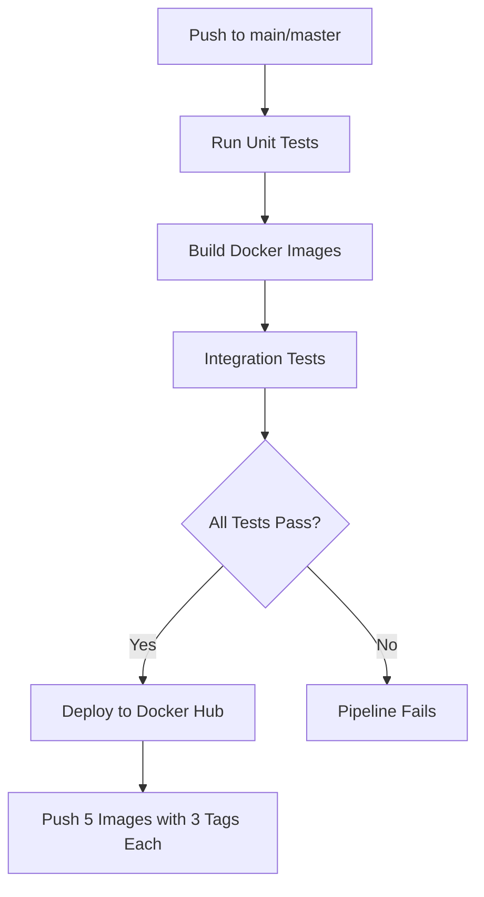

# Docker Hub Deployment Setup Guide

This guide explains how to configure GitHub Actions to automatically deploy Docker images to Docker Hub.

## Prerequisites

1. **Docker Hub Account**: Create an account at [hub.docker.com](https://hub.docker.com)
2. **Docker Hub Access Token**: Generate a token for secure authentication
3. **GitHub Repository Secrets**: Store Docker Hub credentials securely

## Step 1: Create Docker Hub Access Token

1. Log in to [Docker Hub](https://hub.docker.com)
2. Click your profile icon → **Account Settings**
3. Go to **Security** → **Access Tokens**
4. Click **New Access Token**
5. Name it (e.g., `github-actions-hr-system`)
6. Set permissions: **Read, Write, Delete**
7. Click **Generate** and **copy the token** (you won't see it again!)

## Step 2: Configure GitHub Secrets

1. Go to your GitHub repository
2. Navigate to **Settings** → **Secrets and variables** → **Actions**
3. Click **New repository secret**
4. Add the following secrets:

### Required Secrets:

| Secret Name | Value | Description |
|------------|-------|-------------|
| `DOCKERHUB_USERNAME` | Your Docker Hub username | Used for login |
| `DOCKERHUB_TOKEN` | Your Docker Hub access token | Used for authentication |

**To add each secret:**
- Click **New repository secret**
- Enter **Name** (exactly as shown above)
- Enter **Secret** (your actual value)
- Click **Add secret**

## Step 3: Verify Workflow Configuration

The CI/CD pipeline (`.github/workflows/ci.yml`) is already configured with:

### Docker Hub Deployment Job

```yaml
deploy-docker-hub:
  name: Deploy to Docker Hub
  runs-on: ubuntu-latest
  needs: [test-summary]
  if: github.event_name == 'push' && (github.ref == 'refs/heads/main' || github.ref == 'refs/heads/master')
```

### Key Features:

✅ **Automated Deployment**: Triggers on push to `main` or `master` branch  
✅ **Multi-Platform**: Builds for `linux/amd64` and `linux/arm64`  
✅ **Multiple Tags**: Each image gets 3 tags:
- `latest` - Always points to the newest version
- `<commit-sha>` - Specific commit reference
- `<timestamp>` - Build timestamp for tracking

✅ **All Services Deployed**:
- `hr-auth-service`
- `hr-employee-service`
- `hr-performance-service`
- `hr-frontend`
- `hr-nginx`

## Step 4: Test the Deployment

1. **Make a change** to any file in your repository
2. **Commit and push** to `main` or `master` branch:
   ```bash
   git add .
   git commit -m "Test Docker Hub deployment"
   git push origin main
   ```
3. **Monitor the workflow**:
   - Go to **Actions** tab in GitHub
   - Watch the "Microservices CI/CD" workflow
   - Wait for all tests to pass
   - The `deploy-docker-hub` job will run last

4. **Verify on Docker Hub**:
   - Go to [hub.docker.com](https://hub.docker.com)
   - Check your repositories
   - You should see 5 new repositories with the `hr-` prefix

## Deployment Workflow



## Published Docker Images

After successful deployment, the following images will be available on Docker Hub:

| Service | Image Name | Tags |
|---------|-----------|------|
| Auth Service | `<username>/hr-auth-service` | `latest`, `<commit>`, `<date>` |
| Employee Service | `<username>/hr-employee-service` | `latest`, `<commit>`, `<date>` |
| Performance Service | `<username>/hr-performance-service` | `latest`, `<commit>`, `<date>` |
| Frontend | `<username>/hr-frontend` | `latest`, `<commit>`, `<date>` |
| Nginx | `<username>/hr-nginx` | `latest`, `<commit>`, `<date>` |

## Using the Images

### Pull Images from Docker Hub

```bash
# Pull all services
docker pull <your-username>/hr-auth-service:latest
docker pull <your-username>/hr-employee-service:latest
docker pull <your-username>/hr-performance-service:latest
docker pull <your-username>/hr-frontend:latest
docker pull <your-username>/hr-nginx:latest
```

### Deploy Using Docker Compose

Update your `docker-compose.yml` to use Docker Hub images:

```yaml
version: '3.8'

services:
  auth-service:
    image: <your-username>/hr-auth-service:latest
    # ... rest of configuration

  employee-service:
    image: <your-username>/hr-employee-service:latest
    # ... rest of configuration

  performance-service:
    image: <your-username>/hr-performance-service:latest
    # ... rest of configuration

  frontend:
    image: <your-username>/hr-frontend:latest
    # ... rest of configuration

  nginx:
    image: <your-username>/hr-nginx:latest
    # ... rest of configuration
```

Then deploy:

```bash
docker compose pull  # Pull latest images
docker compose up -d # Start services
```

## Deployment Triggers

The Docker Hub deployment **only runs** when:

1. ✅ All unit tests pass
2. ✅ All integration tests pass
3. ✅ Docker images build successfully
4. ✅ Push is to `main` or `master` branch (not pull requests)

## Troubleshooting

### Issue: "Invalid username/password"

**Solution**: Regenerate Docker Hub access token and update `DOCKERHUB_TOKEN` secret

### Issue: "Insufficient privileges"

**Solution**: Ensure access token has **Read, Write, Delete** permissions

### Issue: "Repository not found"

**Solution**: 
- Repositories are created automatically on first push
- Ensure `DOCKERHUB_USERNAME` matches your Docker Hub username exactly (case-sensitive)

### Issue: Workflow doesn't run

**Solution**:
- Check you pushed to `main` or `master` branch
- Ensure all tests passed before deployment
- Check GitHub Actions tab for error messages

## Security Best Practices

✅ **Never commit Docker Hub credentials** to the repository  
✅ **Use access tokens** instead of passwords  
✅ **Rotate tokens regularly** (every 6-12 months)  
✅ **Limit token permissions** to only what's needed  
✅ **Review workflow logs** after deployment  

## Monitoring Deployments

### Check Deployment Status

1. **GitHub Actions**: `Actions` tab → Latest workflow run
2. **Docker Hub**: `Repositories` → Click image → `Tags` tab
3. **Deployment Summary**: Available in GitHub Actions workflow summary

### View Deployment Logs

```bash
# From GitHub Actions workflow page
# Click on the "Deploy to Docker Hub" job
# Expand each step to see detailed logs
```

## Rollback Procedure

If you need to rollback to a previous version:

```bash
# Find previous commit SHA or date tag
docker pull <username>/hr-auth-service:<previous-commit-sha>

# Update docker-compose.yml or use the specific tag
docker compose up -d
```

## Next Steps

- [ ] Set up Docker Hub secrets in GitHub
- [ ] Test deployment with a dummy commit
- [ ] Verify all 5 images appear on Docker Hub
- [ ] Update production docker-compose.yml to use Docker Hub images
- [ ] Set up monitoring for image vulnerabilities
- [ ] Configure automated security scanning

## Additional Resources

- [Docker Hub Documentation](https://docs.docker.com/docker-hub/)
- [GitHub Actions Documentation](https://docs.github.com/en/actions)
- [Docker Build Push Action](https://github.com/docker/build-push-action)

---

**Created**: December 25, 2025  
**Last Updated**: December 25, 2025  
**Maintained By**: HR Management System Team
